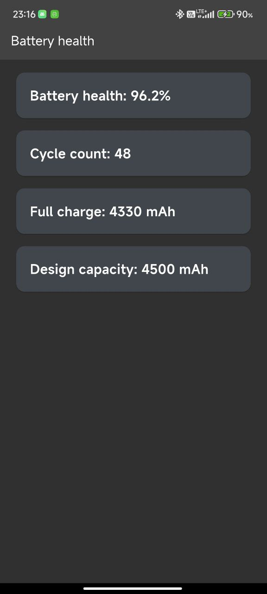

# Battery health for android

 Check battery health of your Android phone. Requires root access.

## ONLY TESTED ON ANDROID 12

Tested devices:

- Redmi Note 8 Pro, CherishOS 4.5 
- Xiaomi 12X, Xiaomi.eu idk what version

The app is built using Flutter and Material3 (Also known as Material You) design. Monet engine does not work. 

### To-do

[] Split app code into more files instead of creating one giant main.dart file 
[] Add tabs at the bottom with categories (device, battery, DRM, SafetyNet) 
  [] Make sure that back button works with it 
[] Add SafetyNet checker 
[] Add DRM info 
[] Add device info 
[] Make sure that app works without root 