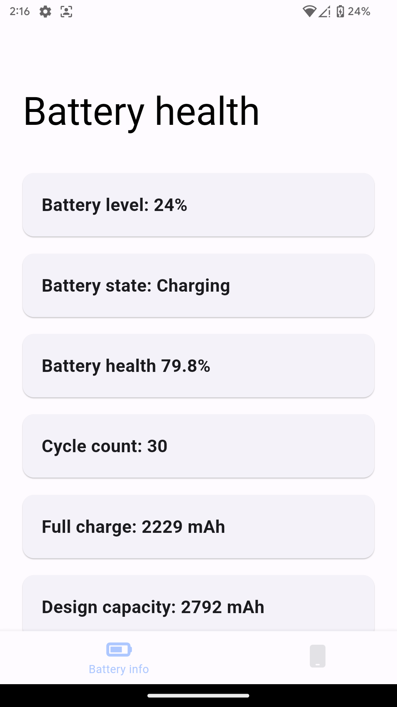
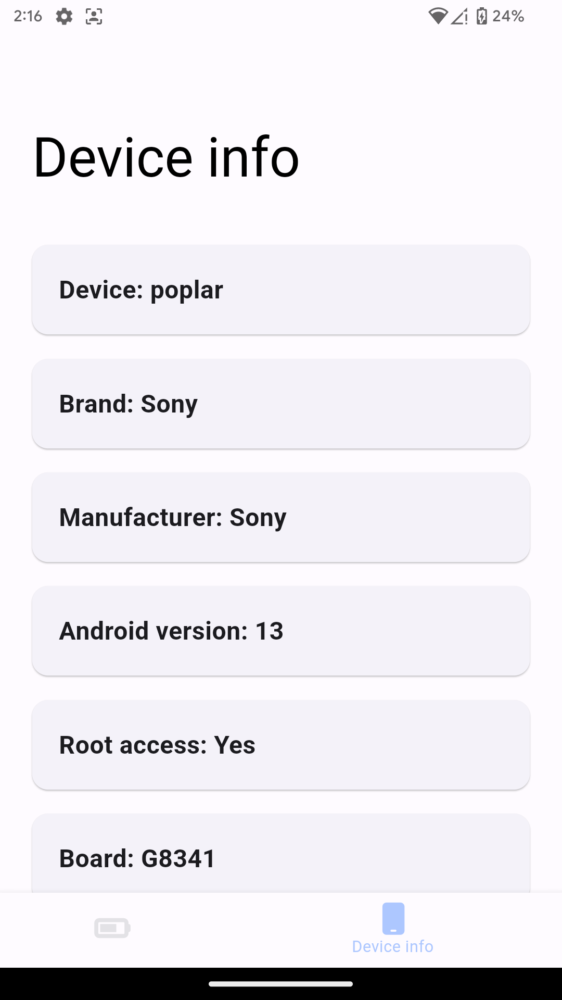
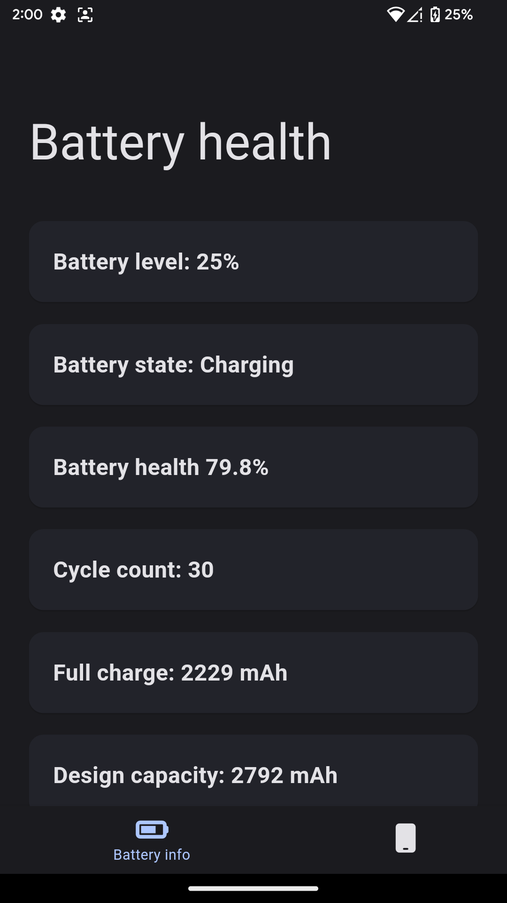
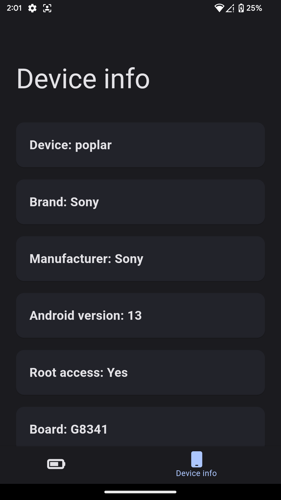

# Android battery health

 Check battery health of your Android phone. Requires root access.

 The app is built using Flutter and Material3 (Also known as Material You) design.
 **This app works only with some rooted devices**

 Tested devices:

| Device            | Android version | Working |
| ----------------- | --------------- | ------- |
| Redmi Note 8 Pro  | 13              | Yes     |
| Sony Xperia XZ1   | 13              | Yes     |
| Samsung Galaxy S6 | 12              | No      |

 Features:

- Battery health percentage
- Cycle count
- Full charge and design capacity values
- Basic device info

## Screenshots

| Theme | Battery health                            | Device info                            |
| ----- | ----------------------------------------- | -------------------------------------- |
| Light |  |  |
| Dark  |   |   |

### To-do

- [ ] Add more up-to-date screenshots
- [ ] Add SafetyNet checker
- [ ] Add DRM info